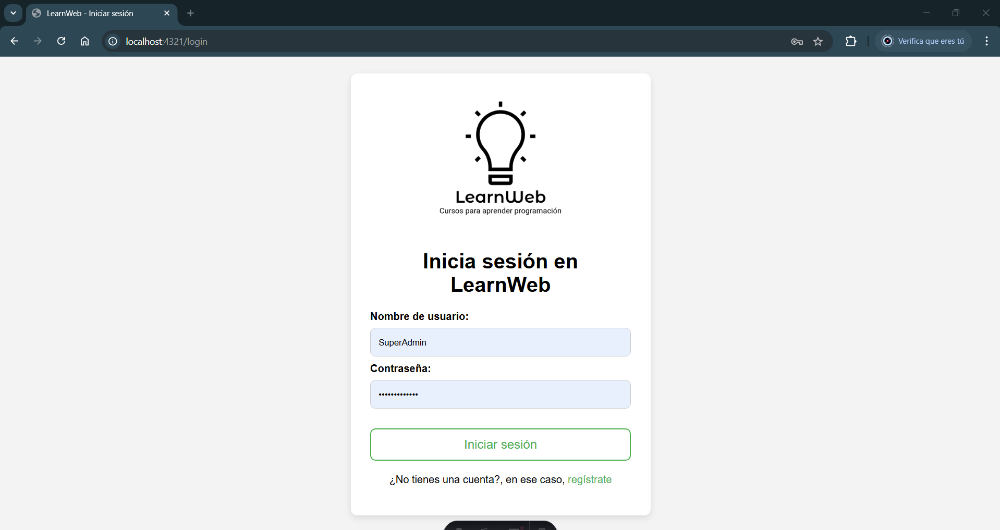
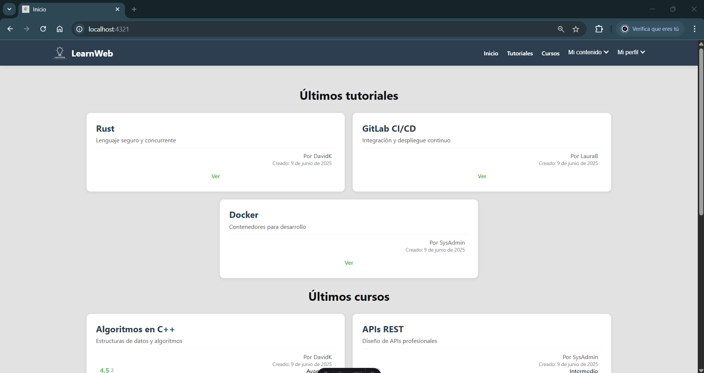

# Documentación LearnWeb

Por Miguel Arroyo Calvo

## Índice

1. [Análisis del problema](#1-análisis-del-problema)
   - 1.1 [Introducción](#11-introducción)
   - 1.2 [Objetivos](#12-objetivos)
   - 1.3 [Funciones y rendimientos deseados](#13-funciones-y-rendimientos-deseados)
   - 1.4 [Planteamiento y evaluación de diversas soluciones](#14-planteamiento-y-evaluación-de-diversas-soluciones)
   - 1.5 [Justificación de la solución elegida](#15-justificación-de-la-solución-elegida)
   - 1.6 [Modelado de la solución](#16-modelado-de-la-solución)
     - 1.6.1 [Recursos humanos](#161-recursos-humanos)
     - 1.6.2 [Recursos hardware](#162-recursos-hardware)
     - 1.6.3 [Recursos software](#163-recursos-software)
   - 1.7 [Planificación temporal](#17-planificación-temporal)
2. [Diseño e implementación del proyecto](#2-diseño-e-implementación-del-proyecto)
   - 2.1 [Arquitectura de la aplicación](#21-arquitectura-de-la-aplicación)
     - 2.1.1 [Controlador](#211-controller)
     - 2.1.2 [Entidad](#212-entity)
     - 2.1.3 [Repositorio](#213-repository)
   - 2.2 [Base de datos](#22-base-de-datos)
     - 2.2.1 [Modelo E/R](#221-modelo-er)
     - 2.2.2 [Esquema de tablas](#222-esquema-de-tablas-sql)
   - 2.3 [Tipos de usuarios](#23-tipos-de-usuarios)
     - 2.3.1 [Administrador](#231-administradores)
     - 2.3.2 [Estudiante](#232-estudiante)
   - 2.4 [Mapa de navegación](#24-mapa-de-navegación)
3. [Fase de pruebas](#3-fase-de-pruebas)
   - 3.1 [Datos de prueba para la BBDD](#31-datos-de-prueba-para-la-bbdd)
   - 3.2 [Docker](#33-docker)
4. [Documentación de la aplicación](#4-documentación-de-la-aplicación)
   - 4.1 [Introducción a la aplicación (Getting Started)](#41-introducción-a-la-aplicación-getting-started)
     - 4.1.1 [Demostraciones gráficas](#411-demostraciones-gráficas-de-la-web)
   - 4.2 [Manual de Instalación](#42-manual-de-instalación)
     - 4.2.1 [Github (Opcional)](#421-github-opcional)
     - 4.2.2 [Instalar MySQL](#422-instalar-mysql)
     - 4.2.3 [Configurar Symfony](#423-configurar-symfony)
     - 4.2.4 [Configurar Astro](#424-configuramos-astro)
     - 4.2.5 [Comprobaciones finales](#425-comprobaciones-finales)
   - 4.3 [Manual de Usuario](#43-manual-de-usuario)
     - 4.3.1 [Registrarse](#431-registrarse)
     - 4.3.2 [Iniciar sesión](#432-iniciar-sesión)
     - 4.3.3 [Ver tutorial o curso](#433-ver-tutorial-o-curso)
     - 4.3.4 [Puntuar tutorial o curso y editar puntuación](#434-puntuar-tutorial--curso-y-editar-puntuación)
     - 4.3.5 [Crear o editar tutoriales](#435-crear--editar-tutoriales)
     - 4.3.6 [Crear o editar curso](#436-crear--editar-cursos)
     - 4.3.7 [Ocultar o mostrar tutoriales y cursos](#437-ocultar--mostrar-tutoriales-y-cursos)
     - 4.3.8 [Filtrar tutoriales o cursos](#438-filtrar-tutoriales--cursos)
   - 4.4 [Manual de Administración](#44-manual-de-administración)
     - 4.4.1 [Editar tutoriales](#441-editar-tutoriales)
     - 4.4.2 [Editar cursos](#442-editar-cursos)
     - 4.4.3 [Ocultar o mostrar tutoriales y cursos](#443-ocultar--mostrar-tutoriales-y-cursos)
     - 4.4.4 [Administrar usuarios](#444-administrar-usuarios)
     - 4.4.5 [Registrar nuevo administrador](#445-registrar-nuevo-administrador)
5. [Conclusiones finales](#5-conclusiones-finales)
   - 5.1 [Posibles mejoras a futuro](#51-posibles-mejoras-a-futuro)

---

# 1. Análisis del problema

## 1.1 Introducción

Esta es la documentación del proyecto LearnWeb.

Aquí encontrarás la estructuración de la base de datos que almacena los usuarios, tutoriales, cursos, etc. Tipos de usuarios, el mapa de navegación, el manual de instalación, de usuario, de administración y manual técnico, las pruebas realizadas y su justificación tecnológica entre otras cosas.

## 1.2 Objetivos

El objetivo de LearnWeb es crear un entorno propicio para el aprendizaje del usuario con una interfaz usable, accesible y con un diseño límpio, con el acceso a tutoriales y cursos relacionados con la programación (aunque ampliable a más ámbitos) y con la facilidad de búsqueda de contenido en concreto mediante filtros.

También es un objetivo el fomento de creación de tutoriales y cursos con un flujo continuo para no estar desactualizados y un cómodo creador / editor de contenido que busca facilitar la tarea.

## 1.3 Funciones y rendimientos deseados

Se quiere implementar:

- Gestión de usuarios (banear, desbanear) para administradores
- Gestión de tutoriales y cursos (crear, editar, ocultar)
- Puntuar tutoriales y cursos y editar dicha puntuación
- Registro e inicio de sesión con contraseña encriptada y manejo de cookies
- Confirmación de cuenta por correo
- Seguimiento de usuario en cursos (poder apuntarse a un curso y completarlo)
- Implementación de exámenes o ejercicios tipo test para realizar tras superar ciertas partes de un curso

## 1.4 Planteamiento y evaluación de diversas soluciones

Como base de datos se manejan 2 opciones: MySQL para base de datos relacional y MongoDB para no relacional.

Como API se plantea el uso de PHP o el de Symfony como framework completo de backend y su posibilidad de implementar arquitectura MVC.

Como frontend se plantea el uso de frameworks como React o Astro por la similaridad entre ambos y el conocimiento de base que se tiene en ambas.

## 1.5 Justificación de la solución elegida

MySQL como base de datos relacional por su sencillez de sintaxis y manejo tanto gráfico con MySQL Workbench o phpMyAdmin como por terminal con comandos.

Symfony por su semi automatización de la arquitectura MVC y la posibilidad de contruir la BBDD a medida.

Astro como framework para frontend por su similaridad a React y su sencillez de manejo.

Para la elaboración de la documentación se utilizará el lenguaje Markdown por su curva de aprendizaje tan sencilla y la posibilidad de exportar a pdf con extensiones.

## 1.6 Modelado de la solución

### 1.6.1 Recursos humanos

Para el proyecto se encargará una persona, pues se entiende que con buena planificación y preparación se puede completar en el plazo de unos meses.

### 1.6.2 Recursos hardware

Para la realización del proyecto se empleará un PC con al menos 8 GB de RAM y 256 GB de almacenamiento, preferiblemente en disco SSD para ayudar en velocidad de lectura / escritura, con una CPU no más antigua de 7-8 años por tema de rendimiento.

### 1.6.3 Recursos software

Para la realización del proyecto se utilizará Visual Studio Code o Codium como alternativa de software libre como editor de texto, Github como servidor web donde alojar el código fuente e ir actualizando el proyecto día tras día y phpMyAdmin o MySQL Workbench 8.0 como gestor gráfico de la base de datos.

### 1.7 Planificación temporal

- Semana 1: Instalación de dependencias y software que vamos a usar para el proyecto, creamos la base de datos vacía y las carpetas de Symfony y Astro con sus respectivos comandos.
- Semana 2: Empezamos a crear las entidades en Symfony, conectamos a la base de datos y migramos para crear las tablas.
- Semana 3: Empezamos a dar las primeras pinceladas del frontend, probamos rutas relativas y tratamos de hacer algún fetch a la base de datos, en Symfony comenzamos a crear métodos en el ApiController, tales como registrarse o iniciar sesión y sus derivados.
- Semana 4: Probamos a registrarnos e iniciar sesión en el frontend, luego empezamos a crear tutoriales, editarlos y ocultarlos.
- Semana 5: Páginas: crear, editar, ocultar... Lo mismo con bloques. Desarrollamos el creador y editor de tutoriales.
- Semana 6: Mostramos las baterias de tutoriales en index, mis tutoriales, tutoriales disponibles... Creamos la página `/see-tutorial?id`.
- Semana 7: Hacemos lo propio con cursos y tutorial en curso.
- Semana 8: Puntuar tutoriales y cursos, funciones de administrador y últimas pinceladas al CSS.
- Semana 9: Dockerización y subir a un servidor.
- Semana 10: Terminar documentación y presentación.

# 2. Diseño e implementación del proyecto

## 2.1 Arquitectura de la aplicación

Sigue el modelo MVC implementado de manera semi-automática gracias a Symfony, que conforma nuestro backend.

```bash

src/
|-- Controller/
|-- Entity/
|-- Repository/

```


La imagen que se muestra arriba es la estructuración del backend (Symfony) del proyecto, donde podemos observar que en la carpeta **src** tenemos las carpetas **Controller**, **Entity** y **Repository**.

### 2.1.1 Controller

Es el intermediario entre la vista o interfaz de usuario y el modelo o lógica del negocio.

Lo utilizamos para:

- Recibir peticiones HTTP como GET, POST, PUT, etc.
- Procesar la información validando, interactuando con la BBDD, etc.
- Devolver una respuesta json, una redirección, renderizar, etc.

        #[Route('/api/users/validate/{nickname}', name: 'app_user_validate', methods: ['GET'])]
        public function validate(SerializerInterface $serializerInterface, String $nickname, UserRepository $userRepository, Request $request): Response
        {
            $user = $userRepository->validateUser($nickname);
            $response = $serializerInterface->serialize($user, 'json');
            return new JsonResponse($response, 200, [
                'Content-Type' => 'application/json'
            ], true);
        }

En nuestro caso la utilizamos para obtener información de la BBDD y devolverla en una respuesta JSON, como en el código de ejemplo de aquí arriba, que lo utilizamos para obtener la existencia de un usuario y si este existe lo mandamos con la respuesta.

También lo utilizamos para otras tareas además de GETs, lo utilizamos para POSTs, PUTs, DELETEs, etc.

Aquí otro ejemplo del uso que le damos:

        // src/Controller/ApiController.php

        #[Route('/api/users/register/{nickname}/{email}/{passwd}', name: 'app_user_register', methods: ['GET', 'POST'])]
        public function register(SerializerInterface $serializerInterface, Request $request, UserPasswordHasherInterface $passwordHasher, EntityManagerInterface $entityManager, String $nickname, String $email, String $passwd, UserRepository $userRepository): Response
        {
            $user = new User();
            $user->setUserType('ROLE_LEARNER');
            $user->setEmail($email);
            $user->setPasswd($passwordHasher->hashPassword($user, $passwd));
            $user->setNickname($nickname);
            $user->setBanned(False);

            $entityManager->persist($user);
            $entityManager->flush();

            $response = $serializerInterface->serialize($user, 'json');
            return new JsonResponse($response, 200, [
                'Content-Type' => 'application/json'
            ], true);
        }

Aquí guardamos un nuevo usuario en la BBDD.

### 2.1.2 Entity

Una entidad o modelo representa un objeto del negocio, como una tabla en la BBDD.

En estas entidades se definen:

- Propiedades, que serían las columnas de la tabla: id, nickname, passwd, etc.
- Relaciones con otras entidades, como que Page pertenece a un Tutorial.
- Validaciones: si puede ser null, longitud máxima de caracteres, etc.
- Getters y setters para las diferentes propiedades de la entidad.

        // src/Entity/Page.php

        namespace App\Entity;

        use App\Repository\PageRepository;
        use Doctrine\Common\Collections\ArrayCollection;
        use Doctrine\Common\Collections\Collection;
        use Doctrine\ORM\Mapping as ORM;
        use ApiPlatform\Metadata\ApiResource;
        use ApiPlatform\Metadata\Delete;
        use ApiPlatform\Metadata\Get;
        use ApiPlatform\Metadata\GetCollection;
        use ApiPlatform\Metadata\Patch;
        use ApiPlatform\Metadata\Post;
        use ApiPlatform\Metadata\Put;
        use App\Controller\ApiController;

        #[ApiResource(
            description: 'App pages',
            operations: [
                new Get(),
                new Post(
                    name: 'new page v2',
                    routeName: 'app_page_new_v2'
                ),
                new GetCollection(),
                new Post(),
                new Put(),
                new Patch(),
                new Delete(),
            ]
        )]
        #[ORM\Entity(repositoryClass: PageRepository::class)]
        class Page
        {
            #[ORM\Id]
            #[ORM\GeneratedValue]
            #[ORM\Column]
            private ?int $id = null;

            #[ORM\Column(length: 255)]
            private ?string $title = null;

            #[ORM\Column(length: 255)]
            private ?string $description = null;

            #[ORM\Column]
            private ?int $orderNumber = null;

            #[ORM\ManyToOne(inversedBy: 'pages')]
            #[ORM\JoinColumn(nullable: false)]
            private ?Tutorial $tutorial = null;

            /**
            * @var Collection<int, Block>
            */
            #[ORM\OneToMany(targetEntity: Block::class, mappedBy: 'page')]
            private Collection $blocks;

            public function __construct()
            {
                $this->blocks = new ArrayCollection();
            }

            public function getId(): ?int
            {
                return $this->id;
            }

            public function getTitle(): ?string
            {
                return $this->title;
            }

            public function setTitle(string $title): static
            {
                $this->title = $title;

                return $this;
            }

            public function getDescription(): ?string
            {
                return $this->description;
            }

            public function setDescription(string $description): static
            {
                $this->description = $description;

                return $this;
            }

            public function getOrderNumber(): ?int
            {
                return $this->orderNumber;
            }

            public function setOrderNumber(int $orderNumber): static
            {
                $this->orderNumber = $orderNumber;

                return $this;
            }

            public function getTutorial(): ?Tutorial
            {
                return $this->tutorial;
            }

            public function setTutorial(?Tutorial $tutorial): static
            {
                $this->tutorial = $tutorial;

                return $this;
            }

            /**
            * @return Collection<int, Block>
            */
            public function getBlocks(): Collection
            {
                return $this->blocks;
            }

            public function addBlock(Block $block): static
            {
                if (!$this->blocks->contains($block)) {
                    $this->blocks->add($block);
                    $block->setPage($this);
                }

                return $this;
            }

            public function removeBlock(Block $block): static
            {
                if ($this->blocks->removeElement($block)) {
                    // set the owning side to null (unless already changed)
                    if ($block->getPage() === $this) {
                        $block->setPage(null);
                    }
                }

                return $this;
            }
        }

En el ejemplo de aquí arriba podemos ver que hemos incluido un método para eliminar bloques (contenido) de una página (function removeBlock), útil para casos en los que queramos eliminar una página completa o solo parte de su contenido.

### 2.1.3 Repository

Se encarga del acceso a los datos:

- Realiza consultas a la BBDD (SELECT, INSERT, etc)
- Contiene métodos reutilizables (findTutorialsAvaidable())

        // src/Repository/CourseRepository.php

        public function findByFilters(
            ?string $search = null,
            ?string $minRating = null,
            ?string $maxRating = null,
            ?string $difficulty = 'any',
            ?string $sortBy = 'recent',
            ?string $hidden = 'available',
        ): array {
            $qb = $this->createQueryBuilder('c')
                ->leftJoin('c.scores', 's')
                ->addSelect('AVG(s.score) as avgRating')
                ->addSelect('COUNT(s.id) as ratingCount')
                ->groupBy('c.id');

            // Filtro de oculto
            if ($hidden !== 'all') {
                $qb->andWhere('c.hidden = :hidden')
                ->setParameter('hidden', false);
            }

            // Filtro de texto (nombre o descripción)
            if ($search !== null) {
                $qb->andWhere('c.name LIKE :search OR c.description LIKE :search')
                ->setParameter('search', '%'.$search.'%');
            }

            // Filtros de puntuación
            if ($minRating !== null) {
                $qb->andHaving('AVG(s.score) >= :minRating')
                ->setParameter('minRating', $minRating);
            }

            if ($maxRating !== null) {
                $qb->andHaving('AVG(s.score) <= :maxRating')
                ->setParameter('maxRating', $maxRating);
            }

            // Filtro de dificultad
            if ($difficulty !== 'any') {
                $qb->andWhere('c.difficulty = :difficulty')
                ->setParameter('difficulty', $difficulty);
            }

            // Ordenación
            switch ($sortBy) {
                case 'rating':
                    $qb->orderBy('avgRating', 'DESC');
                    break;
                case 'popular':
                    $qb->orderBy('ratingCount', 'DESC');
                    break;
                case 'oldest':
                    $qb->orderBy('c.modDate', 'ASC');
                    break;
                default: // 'recent'
                    $qb->orderBy('c.modDate', 'DESC');
            }

            return $qb->getQuery()->getResult();
        }

En el ejemplo de aquí arriba podemos ver un método reutilizable llamado **findByFilters** al que le pasamos los parámetros que obtenemos de los filtros en el frontend, y esta va formando una sentencia SQL en función de lo que tenemos, para obtener los cursos filtrados.

## 2.2 Base de datos

Base de datos relacional mysql, llamada learnweb y funcionando en el puerto 3306.

### 2.2.1 Modelo E/R


Aquí el código erDiagram de el diagrama de la imagen:

    erDiagram
        USER ||--o{ TUTORIAL : "1:N"
        USER ||--o{ COURSE : "1:N"
        USER ||--o{ TUTORIAL_SCORE : "1:N"
        USER ||--o{ COURSE_SCORE : "1:N"
        TUTORIAL ||--o{ PAGE : "1:N"
        PAGE ||--o{ BLOCK : "1:N"
        TUTORIAL ||--o{ TUTORIAL_SCORE : "1:N"
        COURSE ||--o{ TUTORIAL_IN_COURSE : "1:N"
        TUTORIAL ||--o{ TUTORIAL_IN_COURSE : "1:N"
        COURSE ||--o{ COURSE_SCORE : "1:N"

        USER {
            int id PK
            varchar user_type
            varchar email
            varchar nickname
            varchar passwd
            int banned
        }

        TUTORIAL {
            int id PK
            varchar name
            varchar description
            int author_id FK
            int hidden
            datetime add_date
            datetime mod_date
        }

        PAGE {
            int id PK
            int tutorial_id FK
            varchar title
            varchar description
            int order_number
        }

        BLOCK {
            int id PK
            int page_id FK
            varchar type
            varchar content
            int order_number
        }

        TUTORIAL_SCORE {
            int id PK
            int tutorial_id FK
            int user_id FK
            int score
        }

        COURSE {
            int id PK
            int author_id FK
            varchar name
            varchar description
            varchar difficulty
            int hidden
            datetime add_date
            datetime mod_date
        }

        TUTORIAL_IN_COURSE {
            int id PK
            int course_id FK
            int tutorial_id FK
            int order_number
        }

        COURSE_SCORE {
            int id PK
            int course_id FK
            int user_id FK
            int score
        }

En la imagen de arriba podemos observar el diagrama del modelo E/R de la base de datos de LearnWeb. Tenemos las tablas, con el nombre arriba, y de izquierda a derecha por columnas tenemos el tipo de campo, el nombre del campo y si es `PK` (Primary Key o clave primaria) o `FK` (Foreign Key o clave foránea).

Cerca de cada tabla y la linea que marca la relación con otra tabla, podemos ver un signo de igual **=** (o **||**) o un círculo **o** blanco, bien pues el igual indica que en la cardinalidad representa el número de la izquierda, y el círculo representa al de la derecha.
Por ejemplo tenemos la relación de **USER** (||) con **TUTORIAL** (O), donde podemos ver que la cardinalidad es **1:N**, esto quiere decir que un usuario puede tener o crear 1 o varios (**N**) tutoriales (o ninguno si aún no ha creado), mientras que cada tutorial solo puede ser creado por un solo usuario.

Básicamente, todas las relaciones son de uno a muchos (**OneToMany**):

- Un usuario puede crear uno o varios tutoriales, pero solo un autor (user) por tutorial.
- Un usuario puede crear uno o varios cursos, pero solo un autor (user) por curso.
- Un usuario puede puntuar uno o varios tutoriales, pero cada puntuación (`TUTORIAL_SCORE`) a un tutorial puede ser realizada por un usuario.
- Un usuario puede puntuar uno o varios cursos, pero cada puntuación (`COURSE_SCORE`) a un curso puede ser realizada por un usuario
- Cada tutorial puede tener una o varias páginas, pero una página solo puede estar asociada a un tutorial.
- Cada tutorial puede tener una o varias puntuaciones pero cada puntuación (`TUTORIAL_SCORE`) solo va asociada a un solo tutorial (y usuario).
- Cada tutorial puede estar en uno o varios cursos, pero cada asociación de tutorial en curso (`TUTORIAL_IN_COURSE`) solo puede asociarse a un tutorial (y un curso).
- Cada página puede tener uno o varios bloques, pero cada bloque solo puede estar asociado a una página.
- Cada curso puede tener uno o varios tutoriales asociados, pero cada asociación de tutorial en curso (`TUTORIAL_IN_COURSE`) solo puede asociarse a un curso (y un tutorial).
- Cada curso puede tener una o varias puntuaciones, pero cada puntuación (`COURSE_SCORE`) solo puede tener asociado un curso (y un usuario).

**Nota**: El diagrama del modelo E/R que se ve en la imagen ha sido generado con IA (Deepseek), pero solo el dibujo, en todo momento se le ha especificado el nombre de las tablas, los campos y sus tipos, si es PK (Primary Key, Clave primaria) o FK (Foreign Key, Clave foránea) y la relación entre tablas a fin de que solo genere el dibujo del diagrama con el texto.

### 2.2.2 Esquema de Tablas SQL

    CREATE TABLE user (
        id INT AUTO_INCREMENT PRIMARY KEY,
        user_type VARCHAR(50) NOT NULL,
        email VARCHAR(64) NOT NULL UNIQUE,
        nickname VARCHAR(120) NOT NULL UNIQUE,
        passwd VARCHAR(255) NOT NULL,
        banned INT DEFAULT 0
    );

    CREATE TABLE tutorial (
        id INT AUTO_INCREMENT PRIMARY KEY,
        name VARCHAR(255) NOT NULL,
        description VARCHAR(255) NOT NULL,
        author_id INT NOT NULL,
        hidden INT DEFAULT 0,
        add_date DATETIME DEFAULT CURRENT_TIMESTAMP,
        mod_date DATETIME ON UPDATE CURRENT_TIMESTAMP,
        FOREIGN KEY (author_id) REFERENCES user(id)
    );

    CREATE TABLE page (
        id INT AUTO_INCREMENT PRIMARY KEY,
        tutorial_id INT NOT NULL,
        title VARCHAR(255) NOT NULL,
        description VARCHAR(255) NOT NULL,
        order_number INT NOT NULL,
        FOREIGN KEY (tutorial_id) REFERENCES tutorial(id) ON DELETE CASCADE
    );

    CREATE TABLE block (
        id INT AUTO_INCREMENT PRIMARY KEY,
        page_id INT NOT NULL,
        type VARCHAR(255) NOT NULL,
        content VARCHAR(6000) NOT NULL,
        order_number INT NOT NULL,
        FOREIGN KEY (page_id) REFERENCES page(id) ON DELETE CASCADE
    );

    CREATE TABLE tutorial_score (
        id INT AUTO_INCREMENT PRIMARY KEY,
        tutorial_id INT NOT NULL,
        user_id INT NOT NULL,
        score INT NOT NULL,
        FOREIGN KEY (tutorial_id) REFERENCES tutorial(id) ON DELETE CASCADE,
        FOREIGN KEY (user_id) REFERENCES user(id) ON DELETE CASCADE,
        UNIQUE KEY (tutorial_id, user_id)
    );

    CREATE TABLE course (
        id INT AUTO_INCREMENT PRIMARY KEY,
        author_id INT NOT NULL,
        name VARCHAR(255) NOT NULL,
        description VARCHAR(600) NOT NULL,
        difficulty VARCHAR(60) NOT NULL,
        hidden INT DEFAULT 0,
        add_date DATETIME DEFAULT CURRENT_TIMESTAMP,
        mod_date DATETIME ON UPDATE CURRENT_TIMESTAMP,
        FOREIGN KEY (author_id) REFERENCES user(id)
    );

    CREATE TABLE tutorial_in_course (
        id INT AUTO_INCREMENT PRIMARY KEY,
        course_id INT NOT NULL,
        tutorial_id INT NOT NULL,
        order_number INT NOT NULL,
        FOREIGN KEY (course_id) REFERENCES course(id) ON DELETE CASCADE,
        FOREIGN KEY (tutorial_id) REFERENCES tutorial(id) ON DELETE CASCADE,
        UNIQUE KEY (course_id, tutorial_id)
    );

    CREATE TABLE course_score (
        id INT AUTO_INCREMENT PRIMARY KEY,
        course_id INT NOT NULL,
        user_id INT NOT NULL,
        score INT NOT NULL,
        FOREIGN KEY (course_id) REFERENCES course(id) ON DELETE CASCADE,
        FOREIGN KEY (user_id) REFERENCES user(id) ON DELETE CASCADE,
        UNIQUE KEY (course_id, user_id)
    );

Este esquema de Tablas SQL cumple con las 3 Formas Normales:

- 1FN: Todos los campos son atómicos (no hay grupos repetitivos)
- 2FN: Los atributos no clave dependen de la clave primaria
- 3FN: No hay dependencias transitivas

Este modelo difiere un poco del generado por Symfony, pero a efectos prácticos gracias a los repositorios y controladores el funcionamiento es el mismo.

## 2.3 Tipos de Usuarios

### 2.3.1 Administradores

ROLE_ADMIN

Usuarios que pueden gestionar el estado de baneo a otros usuarios. Editar cualquier tutorial o curso, mostrar/ocultar tutoriales o cursos. Registrar nuevos administradores.

### 2.3.2 Estudiante

ROLE_LEARNER

Usuarios corrientes que pueden crear tutoriales/cursos y editar los suyos propios, mostrar/ocultar estos. Puntuar tutoriales/cursos, ver tutoriales/cursos.
Los administradores incluyen estas funciones.

## 2.4 Mapa de Navegación

Para cualquier usuario:

- Iniciar sesión `/login`
- Registrarse `/register`

Para usuarios registrados (con token):

- Inicio `/`
  - Ver tutorial `/see-tutorial?id`
  - Ver curso `/see-course?id`
- Tutoriales `/tutorials`
  - Ver tutorial `/see-tutorial?id`
  - **(admin)** Editar tutorial `/edit-tutorial?id`
    - **(ban)** Usuario baneado `/banned`
    - **(not admin)** Usuario no administrador `/notadmin`
  - **(admin)** Ocultar / mostrar tutorial `/hide-tutorial?id`
    - **(ban)** Usuario baneado `/banned`
    - **(not admin)** Usuario no administrador `/notadmin`
- Cursos `/courses`
  - Ver curso `/see-course?id`
  - **(admin)** Editar curso `/edit-course?id`
    - **(ban)** Usuario baneado `/banned`
    - **(not admin)** Usuario no administrador `/notadmin`
  - **(admin)** Mostrar / ocultar curso `/hide-course?id`
    - **(ban)** Usuario baneado `/banned`
    - **(not admin)** Usuario no administrador `/notadmin`
- Mi contenido (Menú desplegable)
  - Nuevo tutorial `/new-tutorial`
  - Nuevo curso `/new-course`
  - Mis tutoriales `/my-tutorials`
    - Ver tutorial `/see-tutorial?id`
    - Editar tutorial `/edit-tutorial?id`
      - **(ban)** Usuario baneado `/banned`
    - Ocultar / mostrar tutorial `/hide-tutorial?id`
      - **(ban)** Usuario baneado `/banned`
  - Mis cursos `/my-courses`
    - Ver curso `/see-course?id`
    - Editar curso `/edit-course?id`
      - **(ban)** Usuario baneado `/banned`
    - Mostrar / ocultar curso `/hide-course?id`
      - **(ban)** Usuario baneado `/banned`
- Mi perfil (Menú desplegable)
  - Registrarse `/register`
  - Iniciar sesión `/login`
  - **(admin)** Panel de administrador `/admin-panel`
    - **(ban)** Usuario baneado `/banned`
    - **(not admin)** Usuario no administrador `/notadmin`
    - **(admin)** Administrar usuarios `/admin-users`
      - **(ban)** Usuario baneado `/banned`
      - **(not admin)** Usuario no administrador `/notadmin`
      - **(admin)** Banear usuario `/ban-user`
        - **(ban)** Usuario baneado `/banned`
        - **(not admin)** Usuario no administrador `/notadmin`
    - **(admin)** Registrar nuevo usuario `/register-admin`
      - **(ban)** Usuario baneado `/banned`
      - **(not admin)** Usuario no administrador `/notadmin`

Todo lo marcado con **(admin)** comprueba que el rol del usuario es `ROLE_ADMIN`.

Todo lo marcado con **(ban)** es una redirección en caso de que el usuario esté baneado `banned==1`

Todo lo marcado con **(not admin)** es una redirección en caso de que el usuario no sea administrador `role==ROLE_USER`

En 'Mis tutoriales' `/my-tutorials` y 'Mis cursos' `/my-courses` solo aparecen los tutoriales y cursos del usuario de la sesión y solo este puede editar o mostrar/ocultar estos.

En 'Tutoriales' `/tutorials` y 'Cursos' `/courses` los usuarios con rol `ROLE_LEARNER` solo pueden ver un tutorial/curso `/see-tutorial?id` / `/see-course?id`, pero los administradores `ROLE_ADMIN` pueden editar (`/edit-tutorial?id` y `/edit-course?id`) y mostrar/ocultar (`/hide-tutorial?id` y `/hide-course?id`) además.

## 3. Fase de pruebas

En este apartado vamos a mostrar que todas las funciones que nos ofrece la web realmente estén funcionando generando datos y modificándolos a tiempo real.

### 3.1 Datos de prueba para la BBDD

1. Los datos los tendremos en SQL directamente para introducirlos en la BBDD, así que nos metemos en la consola de MySQL

```bash
mysql -u root -p
```

Contraseña: root

2. Una vez dentro, solo queda copiar y pegar por orden (importante) para no tener problemas de relaciones entre tablas, aunque antes tendremos que entrar en nuestra base de datos

```bash
USE learnweb;
```

#### Usuarios

Primero dejaré por aquí los datos de inicio de sesión de cada usuario por si queremos utilizarlos para iniciar sesión luego

Nombre de usuario -> contraseña -> rol

1. SuperAdmin -> AdminPass123! -> Admin
2. Aprendiz1 -> UserPass456! -> Aprendiz
3. AdminHelper -> Secure789! -> Admin
4. JuanP -> JuanPerez123 -> Aprendiz
5. MariaG -> MariaG#2023 -> Aprendiz
6. AlexS -> AlexSmith! -> Aprendiz
7. SysAdmin -> SysAdmin#456 -> Admin
8. LauraB -> LauraBlue$ -> Aprendiz
9. DavidK -> KingDavid2023 -> Aprendiz
10. SaraC -> SaraConor! -> Aprendiz

Las contraseñas tienen cifrado bcrypt en la BBDD

La sentencia SQL para introducirlos:

```bash
INSERT INTO user (user_type, email, passwd, nickname, banned) VALUES ('ROLE_ADMIN', 'admin1@gmail.com', '$2a$10$6khzLWyE6SxgJifuv8rK4uD38hGSAZfFUIulISrApoFUCm5coofH2', 'SuperAdmin', 0), ('ROLE_LEARNER', 'learner1@gmail.com', '$2a$10$dvpf9gk55QkYDWWmWJEkJuO4NZzpFECPVAFuUk2qhI3bTGGD48Mn6', 'Aprendiz1', 0), ('ROLE_ADMIN', 'admin2@hotmail.com', '$2a$10$ZWl.ZeES6Wx8tz/5Dn6deuJQIS168Lccq2mooC0jY7q.Lh4OU9eRa', 'AdminHelper', 0), ('ROLE_LEARNER', 'juan.perez@gmail.com', '$2a$10$adm953ytOgLaSHO96UIWb.b5eAAL8FI91ODX9rMfsnUEw8WZ2.Eq2', 'JuanP', 1), ('ROLE_LEARNER', 'maria.garcia@hotmail.com', '$2a$10$Q/kK2la4XrlB/Qwji8jclu3Km5pFfTCyHmqt0ewKnpBgComvdqIjS', 'MariaG', 0), ('ROLE_LEARNER', 'alex.smith@gmail.com', '$2a$10$LsDxPMgktocr1AP.9nagO.mIo7NsbVxLDpZvVrOIqt9my6zmButci', 'AlexS', 0), ('ROLE_ADMIN', 'sys.admin@hotmail.com', '$2a$10$GeUN3DCNIUoWsJPMJNsL0uCMc78Lfe7BTgrupuXcdu.MyRCts.s/m', 'SysAdmin', 0), ('ROLE_LEARNER', 'laura.blue@gmail.com', '$2a$10$CDY9z3Nn1ohDZFjonbEW4O46I90rOT6IGzeEoTuWq09PrdLn0yQ02', 'LauraB', 0), ('ROLE_LEARNER', 'david.king@hotmail.com', '$2a$10$QS39pp3l1V8w58ePp3bpQut0uuIVED6T75.m0Gfi2sJ8aJAPbpkZ.', 'DavidK', 1), ('ROLE_LEARNER', 'sara.conor@gmail.com', '$2a$10$MTY.XCoH8/o74BzuxRzjPO/vqWyQFOQg0eK2Hxm2QS00/hnJAguTu', 'SaraC', 0);
```

#### Tutoriales

```bash
INSERT INTO tutorial (name, description, author_id, hidden, add_date, mod_date) VALUES ('Introducción a Python', 'Aprende los fundamentos de Python', 1, 0, NOW(), NOW()), ('JavaScript Básico', 'Conceptos esenciales de JavaScript', 2, 0, NOW(), NOW()), ('HTML para principiantes', 'Guía básica de estructura web con HTML', 3, 0, NOW(), NOW()), ('CSS desde cero', 'Estiliza tus páginas web con CSS', 4, 0, NOW(), NOW()), ('SQL Fundamentos', 'Aprende a manejar bases de datos', 5, 0, NOW(), NOW()), ('Java OOP', 'Programación Orientada a Objetos en Java', 6, 0, NOW(), NOW()), ('React Intro', 'Primeros pasos con React', 7, 0, NOW(), NOW()), ('Node.js Básico', 'Introducción a Node.js para backend', 8, 0, NOW(), NOW()), ('Git y GitHub', 'Control de versiones con Git', 9, 0, NOW(), NOW()), ('C++ Moderno', 'Conceptos actuales de C++', 10, 0, NOW(), NOW()), ('Python Avanzado', 'Técnicas avanzadas en Python', 1, 0, NOW(), NOW()), ('JavaScript ES6+', 'Características modernas de JavaScript', 2, 0, NOW(), NOW()), ('Responsive Design', 'Diseño web adaptable con CSS', 3, 0, NOW(), NOW()), ('SQL Avanzado', 'Consultas complejas y optimización', 4, 0, NOW(), NOW()), ('Spring Framework', 'Desarrollo con Spring en Java', 5, 0, NOW(), NOW()), ('React Hooks', 'Uso avanzado de Hooks en React', 6, 0, NOW(), NOW()), ('Express.js', 'Creación de APIs con Express', 7, 0, NOW(), NOW()), ('Git Avanzado', 'Flujos de trabajo profesionales con Git', 8, 0, NOW(), NOW()), ('C++ STL', 'Biblioteca estándar de plantillas en C++', 9, 0, NOW(), NOW()), ('Python Data Science', 'Introducción a pandas y numpy', 10, 0, NOW(), NOW()), ('TypeScript', 'JavaScript tipado para aplicaciones robustas', 1, 0, NOW(), NOW()), ('Vue.js', 'Framework progresivo de JavaScript', 2, 0, NOW(), NOW()), ('SASS/SCSS', 'Preprocesadores CSS para estilos avanzados', 3, 0, NOW(), NOW()), ('NoSQL con MongoDB', 'Bases de datos no relacionales', 4, 0, NOW(), NOW()), ('Kotlin', 'Lenguaje moderno para Android', 5, 0, NOW(), NOW()), ('Angular', 'Framework frontend de Google', 6, 0, NOW(), NOW()), ('Docker', 'Contenedores para desarrollo', 7, 0, NOW(), NOW()), ('GitLab CI/CD', 'Integración y despliegue continuo', 8, 0, NOW(), NOW()), ('Rust', 'Lenguaje seguro y concurrente', 9, 0, NOW(), NOW()), ('Python Web Scraping', 'Extracción de datos web con Python', 10, 1, NOW(), NOW());
```

#### Páginas

```bash
INSERT INTO page (tutorial_id, title, description, order_number) VALUES (1, 'Instalación de Python', 'Cómo instalar Python en tu sistema', 1), (1, 'Hola Mundo en Python', 'Primer programa en Python', 2), (1, 'Variables y tipos', 'Manejo de variables en Python', 3), (2, 'Configuración inicial JS', 'Preparar entorno para JavaScript', 1), (2, 'Sintaxis básica', 'Fundamentos de sintaxis en JavaScript', 2), (3, 'Estructura HTML', 'Etiquetas básicas de HTML', 1), (3, 'Formularios HTML', 'Creación de formularios web', 2), (4, 'Selectores CSS', 'Cómo seleccionar elementos', 1), (4, 'Box Model', 'Modelo de caja en CSS', 2), (5, 'Consultas SELECT', 'Búsqueda de datos en SQL', 1), (5, 'Cláusulas WHERE', 'Filtrado de resultados', 2), (6, 'Clases en Java', 'Conceptos de POO en Java', 1), (6, 'Herencia', 'Relaciones entre clases', 2), (7, 'Componentes React', 'Creación de componentes', 1), (7, 'Estado y props', 'Manejo de datos en React', 2), (8, 'Módulos Node.js', 'Sistema de módulos', 1), (8, 'Servidor HTTP', 'Crear servidor básico', 2), (9, 'Comandos Git', 'Comandos esenciales', 1), (9, 'Ramificaciones', 'Trabajo con branches', 2), (10, 'Punteros en C++', 'Manejo de memoria', 1), (10, 'Templates', 'Plantillas en C++', 2), (11, 'Decoradores Python', 'Funciones avanzadas', 1), (11, 'Generadores', 'Creación de generadores', 2), (12, 'Arrow functions', 'Funciones flecha en ES6', 1), (12, 'Desestructuración', 'Asignación desestructurada', 2), (13, 'Media Queries', 'Adaptabilidad en CSS', 1), (13, 'Flexbox', 'Diseño con Flexbox', 2), (14, 'JOINs SQL', 'Unión de tablas', 1), (14, 'Subconsultas', 'Consultas anidadas', 2), (15, 'Inyección Spring', 'Dependencias en Spring', 1), (15, 'Spring Boot', 'Configuración rápida', 2), (16, 'useState', 'Manejo de estado', 1), (16, 'useEffect', 'Efectos secundarios', 2), (17, 'Rutas Express', 'Sistema de enrutamiento', 1), (17, 'Middleware', 'Funciones intermedias', 2), (18, 'Rebase', 'Reorganización de commits', 1), (18, 'Cherry-pick', 'Selección de commits', 2), (19, 'Vectores STL', 'Contenedores secuenciales', 1), (19, 'Algoritmos STL', 'Funciones predefinidas', 2), (20, 'pandas básico', 'DataFrames en Python', 1), (20, 'numpy arrays', 'Arrays multidimensionales', 2), (21, 'Tipos en TS', 'Sistema de tipos', 1), (21, 'Interfaces', 'Definición de contratos', 2), (22, 'Directivas Vue', 'Funcionalidades template', 1), (22, 'Vuex', 'Manejo de estado', 2), (23, 'Variables SASS', 'Reutilización de valores', 1), (23, 'Mixins', 'Funciones reutilizables', 2), (24, 'Consultas MongoDB', 'Búsqueda documentos', 1), (24, 'Agregaciones', 'Pipeline de datos', 2), (25, 'Null safety', 'Manejo de nulos', 1);
```

#### Bloques

```bash
INSERT INTO block (page_id, type, content, order_number) VALUES (1, 'title', 'Instalación de Python', 1), (1, 'text', 'Python es un lenguaje interpretado, por lo que necesitamos instalarlo antes de usarlo.', 2), (1, 'code', 'sudo apt-get install python3', 3), (2, 'title', 'Hola Mundo en Python', 1), (2, 'text', 'El tradicional primer programa en cualquier lenguaje.', 2), (2, 'code', 'print("Hola Mundo")', 3), (3, 'title', 'Variables en Python', 1), (3, 'text', 'Python es de tipado dinámico, no necesitas declarar el tipo.', 2), (3, 'code', 'nombre = "Juan"\nedad = 25', 3), (4, 'title', 'Configuración de JavaScript', 1), (4, 'text', 'Puedes usar JS directamente en el navegador o con Node.js', 2), (4, 'code', 'console.log("JavaScript listo");', 3), (5, 'title', 'Sintaxis básica JS', 1), (5, 'text', 'JavaScript usa sintaxis similar a C/Java', 2), (5, 'code', 'let x = 5;\nconst y = 10;', 3), (6, 'title', 'Estructura HTML', 1), (6, 'text', 'HTML se compone de etiquetas que definen elementos', 2), (6, 'code', '<html>\n<head></head>\n<body></body>\n</html>', 3), (7, 'title', 'Formularios HTML', 1), (7, 'text', 'Los formularios permiten entrada de datos', 2), (7, 'code', '<form>\n<input type="text">\n</form>', 3), (8, 'title', 'Selectores CSS', 1), (8, 'text', 'Los selectores apuntan a elementos HTML', 2), (8, 'code', 'p {\n  color: red;\n}', 3), (9, 'title', 'Box Model', 1), (9, 'text', 'Todo elemento es una caja con márgenes y padding', 2), (9, 'code', 'div {\n  margin: 10px;\n  padding: 20px;\n}', 3), (10, 'title', 'SELECT en SQL', 1), (10, 'text', 'Consulta básica para recuperar datos', 2), (10, 'code', 'SELECT * FROM usuarios;', 3), (11, 'title', 'WHERE en SQL', 1), (11, 'text', 'Filtra resultados según condiciones', 2), (11, 'code', 'SELECT * FROM productos WHERE precio > 100;', 3), (12, 'title', 'Clases en Java', 1), (12, 'text', 'Las clases son plantillas para objetos', 2), (12, 'code', 'public class Persona {\n  String nombre;\n}', 3), (13, 'title', 'Herencia en Java', 1), (13, 'text', 'Una clase puede heredar de otra', 2), (13, 'code', 'public class Empleado extends Persona {}', 3), (14, 'title', 'Componentes React', 1), (14, 'text', 'Bloques fundamentales de una app React', 2), (14, 'code', 'function MiComponente() {\n  return <div>Hola</div>;\n}', 3), (15, 'title', 'Estado en React', 1), (15, 'text', 'El estado almacena datos del componente', 2), (15, 'code', 'const [contador, setContador] = useState(0);', 3), (16, 'title', 'Módulos Node', 1), (16, 'text', 'Node.js usa módulos para organizar código', 2), (16, 'code', 'const fs = require("fs");', 3), (17, 'title', 'Servidor HTTP', 1), (17, 'text', 'Crear un servidor básico en Node', 2), (17, 'code', 'http.createServer((req, res) => {\n  res.end("Hola");\n});', 3), (18, 'title', 'Comandos Git', 1), (18, 'text', 'Comandos básicos para empezar', 2), (18, 'code', 'git init\ngit add .\ngit commit -m "Mensaje"', 3), (19, 'title', 'Ramas en Git', 1), (19, 'text', 'Las ramas permiten trabajo paralelo', 2), (19, 'code', 'git branch nueva-rama\ngit checkout nueva-rama', 3), (20, 'title', 'Punteros C++', 1), (20, 'text', 'Los punteros almacenan direcciones de memoria', 2), (20, 'code', 'int* ptr = &variable;', 3), (21, 'title', 'Templates C++', 1), (21, 'text', 'Plantillas para funciones genéricas', 2), (21, 'code', 'template <typename T>\nT max(T a, T b) { return a > b ? a : b; }', 3), (22, 'title', 'Decoradores Python', 1), (22, 'text', 'Funciones que modifican otras funciones', 2), (22, 'code', '@decorador\ndef funcion(): pass', 3), (23, 'title', 'Generadores Python', 1), (23, 'text', 'Producen valores sobre la marcha', 2), (23, 'code', 'def generador():\n  yield 1\n  yield 2', 3), (24, 'title', 'Arrow Functions', 1), (24, 'text', 'Sintaxis compacta para funciones', 2), (24, 'code', 'const suma = (a, b) => a + b;', 3), (25, 'title', 'Desestructuración', 1), (25, 'text', 'Extraer valores de objetos/arrays', 2), (25, 'code', 'const { nombre, edad } = persona;', 3), (26, 'title', 'Media Queries', 1), (26, 'text', 'Adaptar estilos a diferentes pantallas', 2), (26, 'code', '@media (max-width: 600px) {\n  body { font-size: 14px; }\n}', 3), (27, 'title', 'Flexbox', 1), (27, 'text', 'Modelo de diseño flexible', 2), (27, 'code', '.contenedor {\n  display: flex;\n}', 3), (28, 'title', 'JOINs SQL', 1), (28, 'text', 'Combinar datos de múltiples tablas', 2), (28, 'code', 'SELECT * FROM tabla1 JOIN tabla2 ON tabla1.id = tabla2.id;', 3), (29, 'title', 'Subconsultas SQL', 1), (29, 'text', 'Consultas dentro de otras consultas', 2), (29, 'code', 'SELECT nombre FROM usuarios WHERE id IN (SELECT user_id FROM pedidos);', 3), (30, 'title', 'Inyección Spring', 1), (30, 'text', 'Spring maneja las dependencias automáticamente', 2), (30, 'code', '@Autowired\nprivate Servicio servicio;', 3), (31, 'title', 'Spring Boot', 1), (31, 'text', 'Configuración automática para Spring', 2), (31, 'code', '@SpringBootApplication\npublic class MiApp {}', 3), (32, 'title', 'useState Hook', 1), (32, 'text', 'Manejar estado en componentes funcionales', 2), (32, 'code', 'const [valor, setValor] = useState(inicial);', 3), (33, 'title', 'useEffect Hook', 1), (33, 'text', 'Efectos secundarios en componentes', 2), (33, 'code', 'useEffect(() => {\n  // efecto\n}, [dependencias]);', 3), (34, 'title', 'Rutas Express', 1), (34, 'text', 'Definir endpoints de la API', 2), (34, 'code', 'app.get("/ruta", (req, res) => res.send("Hola"));', 3), (35, 'title', 'Middleware Express', 1), (35, 'text', 'Funciones que procesan peticiones', 2), (35, 'code', 'app.use((req, res, next) => {\n  // lógica\n  next();\n});', 3), (36, 'title', 'Rebase en Git', 1), (36, 'text', 'Reorganizar el historial de commits', 2), (36, 'code', 'git rebase -i HEAD~3', 3), (37, 'title', 'Cherry-pick', 1), (37, 'text', 'Aplicar commits específicos', 2), (37, 'code', 'git cherry-pick abc123', 3), (38, 'title', 'Vectores STL', 1), (38, 'text', 'Contenedores dinámicos de C++', 2), (38, 'code', 'std::vector<int> numeros = {1, 2, 3};', 3), (39, 'title', 'Algoritmos STL', 1), (39, 'text', 'Funciones predefinidas para colecciones', 2), (39, 'code', 'std::sort(vector.begin(), vector.end());', 3), (40, 'title', 'pandas DataFrame', 1), (40, 'text', 'Estructura principal de pandas', 2), (40, 'code', 'import pandas as pd\ndf = pd.DataFrame(datos);', 3), (41, 'title', 'numpy arrays', 1), (41, 'text', 'Arrays multidimensionales eficientes', 2), (41, 'code', 'import numpy as np\narr = np.array([1, 2, 3]);', 3), (42, 'title', 'Tipos en TypeScript', 1), (42, 'text', 'TypeScript añade tipos a JavaScript', 2), (42, 'code', 'let nombre: string = "Juan";', 3), (43, 'title', 'Interfaces TS', 1), (43, 'text', 'Definen la forma de un objeto', 2), (43, 'code', 'interface Usuario {\n  id: number;\n  nombre: string;\n}', 3), (44, 'title', 'Directivas Vue', 1), (44, 'text', 'Atributos especiales en templates', 2), (44, 'code', '<p v-if="visible">Texto</p>', 3), (45, 'title', 'Vuex Store', 1), (45, 'text', 'Manejo de estado centralizado', 2), (45, 'code', 'const store = new Vuex.Store({\n  state: { contador: 0 }\n});', 3), (46, 'title', 'Variables SASS', 1), (46, 'text', 'Almacenan valores reutilizables', 2), (46, 'code', '$color-primario: #3498db;', 3), (47, 'title', 'Mixins SASS', 1), (47, 'text', 'Bloques reutilizables de estilos', 2), (47, 'code', '@mixin centrar {\n  display: flex;\n  justify-content: center;\n}', 3), (48, 'title', 'Consultas MongoDB', 1), (48, 'text', 'Buscar documentos en colecciones', 2), (48, 'code', 'db.usuarios.find({ edad: { $gt: 18 } });', 3), (49, 'title', 'Agregaciones MongoDB', 1), (49, 'text', 'Procesamiento de datos complejo', 2), (49, 'code', 'db.ventas.aggregate([\n  { $group: { _id: "$producto", total: { $sum: "$cantidad" } } }\n]);', 3), (50, 'title', 'Null Safety', 1), (50, 'text', 'Manejo seguro de valores nulos', 2), (50, 'code', 'var nombre: String? = null', 3);
```

#### Puntuaciones a tutoriales

```bash
INSERT INTO tutorial_score (tutorial_id, user_id, score) VALUES (1, 1, 5), (2, 2, 4), (3, 3, 3), (4, 4, 5), (5, 5, 4), (6, 6, 5), (7, 7, 3), (8, 8, 4), (9, 9, 5), (10, 10, 4), (11, 1, 5), (12, 2, 3), (13, 3, 4), (14, 4, 5), (15, 5, 2), (16, 6, 4), (17, 7, 5), (18, 8, 3), (19, 9, 4), (20, 10, 5), (21, 1, 4), (22, 2, 3), (23, 3, 5), (24, 4, 4), (25, 5, 3), (1, 2, 4), (2, 3, 5), (3, 4, 3), (4, 5, 4), (5, 6, 5), (6, 7, 4), (7, 8, 3), (8, 9, 5), (9, 10, 4), (10, 1, 3), (11, 2, 5), (12, 3, 4), (13, 4, 3), (14, 5, 5), (15, 6, 4), (16, 7, 2), (17, 8, 4), (18, 9, 5), (19, 10, 3), (20, 1, 4), (21, 2, 5), (22, 3, 4), (23, 4, 3), (24, 5, 5), (25, 6, 4);
```

#### Cursos

```bash
INSERT INTO course (author_id, name, description, difficulty, hidden, add_date, mod_date) VALUES (1, 'Python Completo', 'De básico a avanzado en Python', 'beginner', 0, NOW(), NOW()), (2, 'JavaScript Moderno', 'ES6+ y frameworks modernos', 'intermediate', 0, NOW(), NOW()), (3, 'Desarrollo Web Full Stack', 'HTML, CSS y JavaScript completo', 'beginner', 0, NOW(), NOW()), (4, 'Bases de Datos Profesional', 'SQL y NoSQL para aplicaciones reales', 'advanced', 0, NOW(), NOW()), (5, 'Java Enterprise', 'Desarrollo de aplicaciones empresariales', 'advanced', 0, NOW(), NOW()), (6, 'React Profesional', 'Patrones avanzados en React', 'intermediate', 0, NOW(), NOW()), (7, 'Node.js Avanzado', 'Backend con Node y Express', 'intermediate', 0, NOW(), NOW()), (8, 'DevOps Essentials', 'Git, CI/CD y despliegues', 'intermediate', 0, NOW(), NOW()), (9, 'C++ para Sistemas', 'Programación de bajo nivel', 'advanced', 0, NOW(), NOW()), (10, 'Data Science con Python', 'Análisis de datos y machine learning', 'advanced', 0, NOW(), NOW()), (1, 'Python para Automatización', 'Automatiza tareas con Python', 'beginner', 0, NOW(), NOW()), (3, 'CSS Avanzado', 'Animaciones y diseños complejos', 'intermediate', 1, NOW(), NOW()), (5, 'Spring Boot', 'Microservicios con Spring', 'advanced', 0, NOW(), NOW()), (7, 'APIs REST', 'Diseño de APIs profesionales', 'intermediate', 0, NOW(), NOW()), (9, 'Algoritmos en C++', 'Estructuras de datos y algoritmos', 'advanced', 0, NOW(), NOW());
```

#### Tutorial dentro de curso

```bash
INSERT INTO tutorial_in_course (course_id, tutorial_id, order_number) VALUES (1, 1, 1), (1, 11, 2), (1, 20, 3), (2, 2, 1), (2, 12, 2), (2, 21, 3), (3, 3, 1), (3, 4, 2), (3, 13, 3), (4, 5, 1), (4, 14, 2), (4, 24, 3), (5, 6, 1), (5, 15, 2), (6, 7, 1), (6, 16, 2), (6, 22, 3), (7, 8, 1), (7, 17, 2), (8, 9, 1), (8, 18, 2), (9, 10, 1), (9, 19, 2), (10, 11, 1), (10, 20, 2), (11, 1, 1), (11, 11, 2), (12, 3, 1), (12, 13, 2), (13, 6, 1), (13, 15, 2), (14, 8, 1), (14, 17, 2), (15, 10, 1), (15, 19, 2), (15, 29, 3);
```

#### Puntuación a curso

```bash
INSERT INTO course_score (course_id, user_id, score) VALUES (1, 2, 5), (1, 5, 4), (2, 3, 4), (2, 10, 5), (3, 1, 3), (3, 8, 4), (4, 6, 5), (4, 9, 4), (5, 2, 5), (5, 7, 3), (6, 4, 4), (6, 10, 5), (7, 3, 4), (7, 9, 3), (8, 5, 5), (8, 10, 4), (9, 2, 3), (9, 8, 5), (10, 4, 4), (10, 7, 5), (11, 3, 3), (11, 9, 4), (12, 6, 5), (12, 10, 3), (13, 4, 4), (13, 8, 5), (14, 2, 3), (14, 9, 4), (15, 3, 5), (15, 7, 4);
```

Ya podemos salir de la consola

```bash
exit
```

### 3.2 Docker

La comunicación entre contenedores docker no ha funcionado correctamente.

En este apartado veremos mi configuración de Docker en el proyecto.

#### 3.2.1 Instalación

1. Dependencias

```bash
sudo apt-get install docker-ce docker-ce-cli containerd.io docker-buildx-plugin
```

2. Comprobamos que funciona

```bash
sudo docker run hello-world
```

3. Le damos permisos a nuestro usuario para utilizar docker

```bash
sudo usermod -aG docker miguelarroyo
```

Y aplicamos los cambios sin necesidad de reiniciar

```bash
newgrp docker
```

4. Comprobamos la versión de docker

```bash
docker compose version
```

5. Ejecutamos los contenedores, debemos estar situados en la raíz del proyecto

```bash
docker compose up -d --build
```

Si algún puerto está en uso, podemos ver el servicio que lo ocupa y pararlo si es necesario

Ejemplo con mysql:

```bash
sudo lsof -i :3306
sudo systemctl stop mysql
```

Y volvemos a ejecutar los contenedores

6. Una vez iniciados, podemos ver los contendores en activo

```bash
docker ps
```

Mi output:

```bash
CONTAINER ID   IMAGE               COMMAND                  CREATED          STATUS          PORTS                  NAMES
61a6be608650   learnweb-nginx      "/docker-entrypoint.…"   20 minutes ago   Up 20 minutes   0.0.0.0:8888->80/tcp   learnweb-nginx-1
69131e0d368d   learnweb-backend    "docker-php-entrypoi…"   20 minutes ago   Up 20 minutes   8000/tcp, 9000/tcp     learnweb-backend-1
62817037b396   mysql:8             "docker-entrypoint.s…"   20 minutes ago   Up 20 minutes   3306/tcp, 33060/tcp    learnweb-db-1
3b6c45c40330   learnweb-frontend   "docker-entrypoint.s…"   20 minutes ago   Up 20 minutes   4321/tcp               learnweb-frontend-1
```

7. Vamos a ejecutar las migraciones para crear la base de datos

```bash
docker exect -it learnweb-backend-1 bash
```

Una vez dentro de bash

```bash
php bin/console doctrine:migrations:migrate
```

Si pide confirmación, escribe `yes` y pulsa `ENTER`

8. Una vez creadas, accedemos a la consola

```bash
docker exec -it learnweb-db-1 mysql -u root -p LearnWeb
```

9. Dentro de la consola, ya podemos ejecutar cualquier sentencia SQL, como por ejemplo:

```bash
SHOW TABLES;
```

Deberemos meternos en la consola para introducir los datos de prueba mediante sentencias SQL.

Podemos salirnos de la consola con `exit`.

Para reiniciar los contenedores, usamos:

```bash
docker compose down && docker compose up -d --build
```

Deberíamos de poder acceder desde el navegador a http://localhost:8888/login

#### 3.2.2 Fallos

Básicamente estos son los fallos de comunicación entre contenedores:

- Podemos iniciar sesión -> fetch (/api/login/nickname/passwd), pero no podemos obtener los tutoriales disponibles (/api/tutorialsavaidable)

El la petición del login no está protegido por token, pero los tutoriales disponibles si.

El error dice `Failed to parse URL from /api/tutorialsavaidable`

Según los logs del contenedor backend, ni siquiera llega la petición

#### 3.2.3 Toda la configuración relacionada con Docker y Nginx

##### docker-compose.yaml:

    version: "3.8"

    services:
        nginx:
            build: ./nginx
            ports:
            - "8888:80"
            depends_on:
            - frontend
            - backend
            networks:
            - app-network

        frontend:
            build: ./LearnWebAstro
            command: npm run dev -- --host 0.0.0.0
            #ports:
            #  - "4321:4321"
            environment:
            - PUBLIC_API=/api
            volumes:
            - ./LearnWebAstro:/app
            - /app/node_modules
            #depends_on:
            #  - backend
            networks:
            - app-network

        backend:
            build: ./LearnWebApi
            #ports:
            #  - "8000:8000"
            environment:
            - DATABASE_URL=mysql://root:root@db:3306/LearnWeb
            - APP_ENV=dev
            volumes:
            - ./LearnWebApi:/var/www/symfony
            depends_on:
            - db
            networks:
            - app-network

        db:
            image: mysql:8
            environment:
            MYSQL_ROOT_PASSWORD: root
            MYSQL_DATABASE: LearnWeb
            #ports:
            #  - "3306:3306"
            volumes:
            - mysql_data:/var/lib/mysql
            networks:
            - app-network

    networks:
    app-network:
        driver: bridge

    volumes:
    mysql_data:

##### nginx/Dockerfile:

    FROM nginx:alpine

    COPY nginx.conf /etc/nginx/conf.d/default.conf

    EXPOSE 80

##### nginx/nginx.conf

    server {
        listen 80;
        server_name localhost;

        # Frontend (Astro)
        location / {
            proxy_pass http://frontend:4321;
            proxy_set_header Host $host;
            proxy_set_header X-Real-IP $remote_addr;
            proxy_set_header X-Forwarded-For $proxy_add_x_forwarded_for;
            proxy_set_header X-Forwarded-Proto $scheme;

            # HMR support
            proxy_http_version 1.1;
            proxy_set_header Upgrade $http_upgrade;
            proxy_set_header Connection "upgrade";
        }

        # Backend (Symfony) - Cambiado a /api/
        location /api/ {
            proxy_pass http://backend:8000/;  # Barra final importante
            proxy_set_header Host $host;
            proxy_set_header X-Real-IP $remote_addr;
            proxy_set_header X-Forwarded-For $proxy_add_x_forwarded_for;
            proxy_set_header X-Forwarded-Proto $scheme;
        }

    }

##### LearnWebAstro/Dockerfile

    FROM node:lts

    WORKDIR /app

    COPY package\*.json ./
    RUN npm install

    COPY . .

    ENV HOST=0.0.0.0
    ENV PORT=4321

    EXPOSE 4321

    CMD ["npm", "run", "dev", "--", "--host", "0.0.0.0"]

##### LearnWebAstro/.dockerignore

    .DS_Store
    node_modules
    dist
    .env

##### LearnWebAstro/src/api/api.js

    // Prefijo para las rutas (uso en Docker + proxy inverso Nginx)
    const API_PREFIX = "/api";

    /**
    * Construye una URL completa para los endpoints de la API, eliminando /api duplicados, solo útil realmente cuando usamos Docker + proxy inverso Nginx
    * @param {string} endpoint - Ruta del endpoint
    * @returns {string} URL completa formateada
    */
    const buildUrl = (endpoint) => {
        // Elimina cualquier /api duplicado
        const cleanEndpoint = endpoint.replace(/^\/?api\//, "");
        return `${API_PREFIX}/${cleanEndpoint}`;
    };

    /**
    * Realiza una petición GET a la API, sin token, usado principalmente para iniciar sesión con un usuario cuando aún no se ha guardado token, o para comprobar si existe un usuario dado el nickname y email (en registro)
    * @param {string} endpoint - Ruta del endpoint
    * @returns {Promise<Object>} Respuesta de la API parseada como JSON
    * @throws {Error} Si la respuesta no es exitosa
    */
    const get = async (endpoint) => {
    const url = buildUrl(endpoint);
    const response = await fetch(`api/${url}`, {
        method: "GET",
        headers: {
            accept: "application/json",
            "Content-Type": "application/json",
        },
    });
    if (!response.ok) {
        throw new Error(
            `Error en la petición GET al endpoint: ${endpoint} (${response.status} ${response.statusText})`
        );
    }
    const data = await response.json();
        return data;
    };


    /**
    * Realiza una petición GET autenticada con JWT
    * @param {string} endpoint - Ruta del endpoint
    * @param {string} token - Token JWT de autenticación
    * @returns {Promise<Object>} Respuesta de la API parseada como JSON
    * @throws {Error} Si la respuesta no es exitosa
    */
    const get_jwt = async (endpoint, token) => {
        const url = buildUrl(endpoint);
        console.log(`${url}`);
        const response = await fetch(url, {
            method: "GET",
            headers: {
            Authorization: `Bearer ${token}`,
                accept: "application/json",
                "Content-Type": "application/json",
        },
    });
    if (!response.ok) {
        throw new Error(
            `Error en la petición GET al endpoint: ${endpoint} (${response.status} ${response.statusText})`
        );
    }
    const data = await response.json();
        return data;
    };

##### LearnWebAstro/src/api/useCases.js

    /**
    * Obtiene un usuario por credenciales de acceso
    * @param {string} nickname - Nombre de usuario
    * @param {string} passwd - Contraseña
    * @returns {Promise<Object>} Datos del usuario
    */
    const getUserByLogin = async (nickname, passwd) => {
        const endpoint = `users/login/${nickname}/${passwd}`;
        const data = await get(endpoint);
        return data;
    };

    /**
    * Obtiene tutoriales disponibles (requiere autenticación)
    * @param {string} token - Token JWT
    * @returns {Promise<Array>} Lista de tutoriales
    */
    const getTutorialsAvaidable = async (token) => {
        const endpoint = "tutorialsavaidable";
        const data = await get_jwt(endpoint, token);
        return data;
    };

##### LearnWebApi/Dockerfile

    # Usamos una imagen base de PHP con Composer y Nginx
    FROM php:8.2-fpm

    # Instalar dependencias
    RUN apt-get update && apt-get install -y \
        libicu-dev \
        libpq-dev \
        libzip-dev \
        git \
        unzip \
        libcurl4-openssl-dev \
        libpng-dev \
        libjpeg-dev \
        libfreetype6-dev \
        && docker-php-ext-configure gd --with-freetype --with-jpeg \
        && docker-php-ext-install intl pdo pdo_mysql zip gd curl

    # Instalar Symfony CLI
    RUN curl -sS https://get.symfony.com/cli/installer | bash \
        && mv /root/.symfony*/bin/symfony /usr/local/bin/symfony

    # Instalar Composer
    COPY --from=composer:latest /usr/bin/composer /usr/bin/composer

    # Definir el directorio de trabajo
    WORKDIR /var/www/symfony

    # Copiar los archivos de la aplicación Symfony
    COPY . .

    # Instalar dependencias de Symfony (Composer)
    RUN composer install --no-interaction --prefer-dist

    # Exponer el puerto 8000
    EXPOSE 8000

    # Comando para ejecutar Symfony en modo de desarrollo
    CMD ["symfony", "server:start", "--no-tls", "--allow-http", "--allow-all-ip", "--port=8000"]

##### LearnWebApi/docker-compose.yaml

    services:
        backend:
            ports:
                - "8000:8000"

##### LearnWebApi/.env

    CORS_ALLOW_ORIGIN='^https?://(localhost|127\.0\.0\.1|frontend|backend)(:[0-9]+)?$'

##### LearnWebApi/config/packages/nelmio_cors.yaml

    nelmio_cors:
        defaults:
            allow_credentials: true
            allow_origin: ["*"] # Cambiar a ['http://frontend:4321'] o ['http://localhost:4321'] si deseas restringir
            allow_headers: ["Content-Type", "Authorization"]
            allow_methods: ["GET", "POST", "PUT", "DELETE", "OPTIONS"]
            max_age: 3600
        paths:
            "^/api/":
            allow_origin: ["*"]
            allow_methods: ["*"]
            allow_headers: ["Content-Type", "Authorization"]

##### LearnWebApi/config/packages/security.yaml

    security:
        password_hashers:
            App\Entity\User:
            algorithm: "auto"
            cost: 15

        providers:
            app_user_provider:
            entity:
                class: App\Entity\User
                property: id

        firewalls:
            login:
            pattern: ^/api/users/login
            stateless: true
            json_login:
                check_path: /api/users/login
                username_path: nickname
                password_path: passwd
                success_handler: lexik_jwt_authentication.handler.authentication_success
                failure_handler: lexik_jwt_authentication.handler.authentication_failure

            api:
            pattern: ^/api
            stateless: true
            jwt: ~

        access_control:
            - { path: ^/api/users/login, roles: PUBLIC_ACCESS }
            - { path: ^/api/users/register, roles: PUBLIC_ACCESS }
            - { path: ^/api, roles: ROLE_LEARNER }
            - { path: ^/admin, roles: ROLE_ADMIN }

#### 3.2.4 Posibles causas

- Problema con las rutas, según la configuración de nginx y las rutas del backend
- Configuración incorrecta de las claves PEM, pues están en la carpeta config/jwt pero no están configuradas ni en docker ni en nginx

# 4. Documentación de la aplicación

## 4.1 Introducción a la aplicación (Getting started)

LearnWeb se trata de una plataforma de tutoriales y cursos para aprender o enseñar a programar en diferentes lenguajes y para varios niveles de usuario, aunque por su sencillez está enfocado en principiantes.

En esta web se pueden crear y editar tutoriales, además de cursos, que son baterías de tutoriales. También dispondrás de unos filtros para encontrar justo lo que buscabas y además podrás valorar los tutoriales y cursos para facilitar el filtrado de calidad según la opinión general del consumidor.

Los administradores podrán editar cualquier tutorial o curso, además de banear usuarios. Esto último les impedirá poder crear, editar o puntuar tutoriales y cursos, aunque podrán seguir visualizándolos.

LearnWeb esta especialmente dirigido a cualquier novato curioso del mundo de la programación, aunque el objetivo sea disponer de tutoriales y cursos para todos los niveles, la sencillez es lo que más se premia, pues es perfecto para visualizar en cualquier dispositivo allá donde vayas, y dispone de una interfaz limpia y sencilla para su uso en cualquier momento y lugar.

Para poder usar esta web simplemente es necesario un navegador web (Chrome, Firefox, Safari, OperaGX, Brave, etc) que interprete correctamente HTML5 y CSS3. También será necesaria una cuenta de usuario.

### 4.1.1 Demostraciones gráficas de la web

**Inicio de sesión** `/login`



**Registro** `/register`


**Página principal** `/`



En esta página nos encontramos con los 3 últimos tutoriales y cursos.

Podemos pinchar sobre "ver" en uno de los tutoriales o cursos para verlo.

La información que aparece en cada tutorial y curso se puede averiguar en el apartado de más abajo que pone Tutoriales `/tutorials` y Cursos `/courses`.

**Menús desplegables**


Menús desplegables que aparecen al poner el ratón sobre "Mi contenido" y sobre "Mi perfil".

**Tutoriales** `/tutorials`


En esta imagen de arriba podemos ver los diferentes tutoriales y filtrarlos con nuestros filtros.


**Cursos** `/courses`


Las "tarjetas" de los cursos son casi idénticas al de los tutoriales, solo difieren en que los cursos muestran también la dificultad debajo de la fecha de creación y modificación.

**Ver tutorial** `/see-tutorial?id`


En la imagen de arriba observamos un tutorial, la información que se nos ofrece es el título y, de izquierda a derecha, fecha de creación (y modificación si la hay), autor y valoraciones. Debajo podemos observar el calificador y aún más abajo las páginas del tutorial y su contenido.


En la imagen de arriba podemos observar las páginas de un tutorial y su contenido.

**Ver curso** `/see-course?id`


En la imagen de arriba observamos varios datos del curso como el nombre y descripción, fecha de creación y modificación de este, puntuación y autor.

Debajo de esta se encuentra el calificador y debajo del calificador tenemos a izquierda el índice de tutoriales, con el que podemos ir cambiado de tutorial, y a la derecha ocupando la mayoría del espacio en ancho tenemos el tutorial mostrándose.


En la imagen de arriba vemos más del tutorial que estamos visualizando del curso.


En la imagen de arriba podemos observar que al final de cada tutorial de un curso tenemos 2 botones **<< y >>** que nos indica a que tutorial nos queremos dirijir, si anterior o siguiente.

**Crear tutorial** `/new-tutorial`


En la imagen de arriba se puede observar la página básica de crear tutorial, tenemos el título y descripción para rellenar, el botón de nueva página y el de listo para mandar el tutorial.


En la imagen de arriba se puede observar el elemento de la página en la creación del tutorial, esta consta de título y descripción para rellenar, así como botones para ir añadiendo nuevos bloques de contenido a la página.

**Crear curso** `/new-course`


En la imagen de arriba podemos observar la página de crear curso, esta se compone de los inputs de título, descripción y el selector de dificultad. Más abajo tenemos los tutoriales que podemos añadir o quitar para el curso.

**Mostrar mis tutoriales** `/my-tutorials`


En la imagen de arriba podemos observar la página de "mis tutoriales", esta muestra los tutoriales creados por el usuario de la sesión.

**Mostrar mis cursos** `/my-courses`


En la imagen de arriba podemos observar la página de "mis cursos", en esta se muestra los cursos creados por el usuario de la sesión.

**Editar tutorial** `/edit-tutorial?id`


En la imagen de arriba podemos observar la página de edición de un tutorial, esta es igual a la de crear tutorial, son esencialmente la misma, solo que en esta se carga el tutorial para poder editarlo.

**Editar curso** `/edit-course?id`


En la imagen de arriba podemos observar la página de edición de un curso, esta es igual a la de crear curso, son esencialmente la misma, solo que en esta se carga el curso para poder editarlo.

**Panel de administrador** `/admin-panel`


En la imagen de arriba se puede observar la página del panel de administrador. Esta solo dispone de 2 enlaces: administrar usuarios y registrar nuevo administrador.

**Administrar usuarios** `/admin-users`


En la imagen de arriba se puede observar la página de administrar usuarios. Esta dispone de las tarjetas de cada usuarios, mostrando su nickname y correo, así como su rol y un botón de banear / desbanear.

**Registrar nuevo administrador** `/register-admin`


En la imagen de arriba se puede observar la página de registrar nuevo administrador. Esta página es esencialmente la misma que registrar, realmente solo cambia el rol con el que registra al usuario.

**Página de beaneado** `/banned`


En la imagen de arriba se puede observar la página de baneado. Esta página solo dispone del texto de aviso sobre baneo y un enlace al inicio (`/`).

**Página de no administrador** `/notadmin`


En la imagen de arriba se puede observar la página de no administrador. Esta página solo dispone del texto de aviso sobre los no permisos de administrador que posee el usuario y tiene un enlace al inicio (`/`).

## 4.2 Manual de Instalación

### 4.2.1 Github (Opcional)

Este es el repositorio del proyecto LearnWeb https://github.com/Miguelarcal/LearnWeb.git

Vamos a instalar Github (si aún no lo tenemos) para bajar el proyecto del repositorio y aprender a subir los cambios que hagamos a la rama principal o a cualquier otra

#### Instalación

##### Debian / Ubuntu

```bash
sudo apt update && sudo apt install git
```

Verificamos la instalación

```bash
git --version
```

##### Windows

Instalamos el ejecutable desde [aquí](https://git-scm.com/downloads/win)

Al ejecutarlo nos aseguramos de marcar **Add Git to PATH**

Verificamos la instalación

```bash
git --version
```

#### Configuración

Configuramos el usuario y email

```bash
git config --global user.name "Tu Nombre"
git config --global user.email "tu-email@example.com"
```

Generamos una clave SSH para poder clonar el repositorio

```bash
ssh-keygen -t ed25519 -C "tu-email@example.com"
```

Presionamos 3 veces `ENTER` si no necesitas contraseña

Verificamos que se han creado los archivos

```bash
ls ~/.ssh/
```

Deberíamos ver algo así

```bash
id_ed25519
id_ed25519.pub
```

Copiamos el contenido de la clave pública con este comando

```bash
cat ~/.ssh/id_ed25519.pub | clip
```

Nos metemos en nuestro Github en algún navegador o en la app de escritorio si la tienes, y nos dirigimos a `Perfil -> SSH and GPG keys -> New SSH Key -> Key` y le damos un título como por ejemplo ClaveWindows, luego pega la clave debajo del título y guarda la Key.

Probamos si nos podemos autenticar

```bash
ssh -T git@github.com
```

Escribimos `yes` y presionamos `ENTER`

Si lo hemos conseguido, nos debería de salir algo así:

```bash
Hi username! You've successfully authenticated...
```

#### Clonar repositorio

Si es la primera vez que bajamos el repositorio en este equipo, lo clonamos

```bash
git clone https://github.com/Miguelarcal/LearnWeb.git
```

Si ya lo tenías clonado con anterioridad basta con copiarlo

```bash
git remote add origin https://github.com/Miguelarcal/LearnWeb.git
```

#### Ramas

Cada rama es como una copia de una rama al momento de crearla, pueden tener diferencias con la rama principal (main o master) a medida que se modifica y más adelante podemos fusional estas ramas.

Para listar las ramas locales

```bash
git branch
```

Para incluir las remotas también

```bash
git branch -a
```

Para crear una rama nueva (sin moverse a ella)

```bash
git branch nueva-rama
```

O para crearla y movernos a ella

```bash
git checkout -b nueva-rama
```

Para movernos entre ramas

```bash
git checkout nombre-rama
```

Para borrar una rama

```bash
git branch -d nombre-rama
git branch -D nombre-rama # para forzar el borrado
git push origin --delete nombre-rama # para borrar una rama remota
```

Para renombrar una rama local

```bash
git branch -m nombre-actual nombre-nuevo
```

Sincronizar ramas remotas

```bash
git fetch --all # descargamos las ramas remotas
git pull origin nombre-rama # para actualizar la rama local con la remota
```

En la rama **main** se encuentra el contenido de antes de la entrega del proyecto, en la rama **post-entrega** el contenido añadido / modificado /borrado posterior a esta.

#### Commits

Para actualizar el contenido del repositorio con el que has añadido, quitado o modificado, debemos efectuar un commit

Los cambios que efectuemos y subamos al repositorio serán desde y hacia la rama en la que estamos situados

Añadimos los cambios al registro

```bash
git add .
```

Si quisiéramos añadir unos cambios mucho más selectivos (solo una carpeta, un archivo, etc)

```bash
git add nombre-archivo
```

Añadimos el registro de cambios al commit

```bash
git commit -m "Initial commit: Breve descripción de los cambios"
```

Por último subimos el commit al repositorio, a la rama que indiquemos

```bash
git push -u origin nombre-rama
```

### 4.2.2 Instalar MySQL

#### Debian / Ubuntu

1. Lo instalamos e iniciamos

```bash
sudo apt update && sudo apt install mysql-server
systemctl start mysql
```

2. Accedemos a la BBDD

```bash
mysql -u root -p
```

Contraseña: `root`

3. Ya podemos ejecutar cualquier consulta, para salir basta con escribir `exit`

#### En Windows

1. Lo descargamos desde esta URL: [MySQL](https://dev.mysql.com/downloads/installer/)

2. Lo añadimos al PATH de `Variables de entorno del sistema`

3. Accedemos a la BBDD

```bash
mysql -u root -p
```

Contraseña: `root`

4. Creamos la base de datos de learnweb

```bash
CREATE DATABASE learnweb;
```

5. Nos metemos en la base de datos learnweb

```bash
USE learnweb;
```

6. Ya podemos ejecutar cualquier consulta, para salir basta con escribir `exit`

### 4.2.3 Configurar Symfony

#### Instalamos PHP

##### Ubuntu / Debian

1. Instalación

```bash
sudo apt update
sudo apt install php php-cli php-fpm php-mysql php-curl php-zip php-xml php-mbstring php-intl
```

2. Verificamos la instalación

```bash
php -v
```

##### Windows

1. En Windows accedemos a este [enlace](https://windows.php.net/download/) y elegimos la versión Non-Thread Safe.

2. Luego extraemos el ZIP en C:\php

3. Configuramos el PATH en "Variables de entorno del sistema", puedes buscarlo en la barra de búsqueda de Windows, y en PATH agregamos C:\php

4. Verificamos la instalación

```bash
php -v
```

#### Instalamos Composer

##### Linux

1. Instalamos

```bash
php -r "copy('https://getcomposer.org/installer', 'composer-setup.php');"
php composer-setup.php
php -r "unlink('composer-setup.php');"
```

2. Movemos composer a un directorio global

```bash
mv composer.phar /usr/local/bin/composer
```

3. Verificamos la instalación

```bash
composer -v
```

##### Windows

1. Descargamos el instalador desde este [enlace](https://getcomposer.org/download/) en manual download

2. Ejecutamos el instalador y nos aseguramos de marcar la opción de "Add to PATH"

3. Verificamos la instalación

```bash
composer -v
```

#### Seguimos con Symfony

1. Nos vamos a la raíz del backend (LearnWebApi) e instalamos las dependencias

```bash
composer install
```

2. Ejecutamos las migraciones para crear las tablas

```bash
php bin/console doctrine:migrations:migrate
```

En caso de que no estuvieran creadas las migraciones, las creamos

```bash
php bin/console make:migration
```

Y ahora si las migraríamos con el comando del paso 2

#### Claves PEM para la gestión de los JWT Token

##### Linux Debian

1. Instalamos openssl

```bash
sudo apt install openssl -y
```

2. Comprobamos que se ha instalado

```bash
openssl version
```

3. Creamos la carpeta config/jwt desde la raíz del backend

```bash
mkdir -p config/jwt
```

4. Generamos las claves

```bash
openssl genpkey -out config/jwt/private.pem -aes256 -algorithm rsa -pkeyopt rsa_keygen_bits:4096
```

5. Nos pedirá un PEM Pass Phrase, introducimos la que tenemos en .env

6. Terminamos de generar las claves

```bash
openssl pkey -in config/jwt/private.pem -out config/jwt/public.pem -pubout
```

7. Nos aseguramos de tener permisos para acceder a las claves

```bash
chmod 600 config/jwt/private.pem
chmod 644 config/jwt/public.pem
```

##### Windows

1. Lo descargamos desde el siguiente [enlace](https://slproweb.com/products/Win32OpenSSL.html) (que sea la versión lite preferiblemente)

2. Añadimos C:\Program Files\OpenSSL-Win64\bin al PATH de variables de entorno del sistema

3. Comprobamos que ya está correctamente instalado y usable

```bash
openssl version
```

4. Creamos la carpeta config/jwt desde la raíz del backend

```bash
mkdir -p config/jwt
```

5. Generamos las claves

```bash
openssl genpkey -out config/jwt/private.pem -aes256 -algorithm rsa -pkeyopt rsa_keygen_bits:4096
```

6. Nos pedirá un PEM Pass Phrase, introducimos la que tenemos en .env

7. Terminamos de generar las claves

```bash
openssl pkey -in config/jwt/private.pem -out config/jwt/public.pem -pubout
```

8. Nos aseguramos de cambiar los permisos para poder acceder con nuestro usuario de Windows a los archivos

#### Terminamos con Symfony

1. Iniciamos el servidor Symfony

```bash
symfony server:start
```

El backend estará en http://localhost:8000 y http://127.0.0.1:8000, puedes acceder a la api con un /api al final

2. Comprobamos que está funcionando

```bash
symfony server:status
```

Para parar el servidor:

```bash
symfony server:stop
```

### 4.2.4 Configuramos Astro

#### Instalar Node.js

##### Ubuntu / Debian

```bash
curl -fsSL https://deb.nodesource.com/setup_20.x | sudo -E bash -
sudo apt install -y nodejs
```

Verificamos la instalación

```bash
node -v
```

##### Windows

Descargamos Node.js (versión LTS) desde [aquí](https://nodejs.org/es)

Al ejecutar el instalador nos aseguramos de marcar la opción "Add to PATH"

Verificamos la instalación

```bash
node -v
```

#### Terminamos con Astro

En la raíz del frontend, instalamos las dependecias del proyecto

```bash
npm install
```

E iniciamos el frontend

```bash
npm run dev
```

Accesible desde http://localhost:4321

Supuestamente ya debería de estar todo en funcionamiento, sería el turno de rellenar la BBDD con datos si se desea

### 4.2.5 Comprobaciones finales

Comprobamos que todos los servicios estén funcionando en sus respectivos puertos

#### Ubuntu / Debian

```bash
sudo lsof -i :4321,3306,8000
```

Deberíamos ver mysql, Symfony y node

#### Windows

```bash
netstat -ano | findstr ":4321 :3306 :8000"
```

## 4.3 Manual de Usuario

En este manual explicaremos brevemente los pasos que se deben de seguir para poder aprovechar todas las funciones que ofrece la web a un usuario corriente que se ha registrado.

### 4.3.1 Registrarse


Como se puede observar en la imagen de arriba, en la página de `/register` tenemos el formulario de registro de un nuevo usuario.

Para registrar un nuevo usuario solo debemos de rellenar las casillas correspondientes con (por orden de arriba a abajo):

- Correo electrónico (@gmail.com o @hotmail.com)
- Nickname o nombre de usuario
- Contraseña
- Repetir la contraseña

El registro fallará y pedirá que vuelvas a introducir los datos si:

- No rellenas alguna casilla
- El nombre de usuario o email ya existe con otro usuario
- La contraseña no coincide con la repetida

Al terminar y comprobar que no hay fallos, solo habría que darle a "enviar" para registrar dicho usuario.

### 4.3.2 Iniciar sesión


Como se puede observar en la imagen de arriba, en la página de `/login` tenemos el formulario de inicio de sesión.

Para iniciar sesión se deberá de rellenar las casillas con (por orden de arriba a abajo):

- Nombre de usuario o nickname
- Contraseña

El inicio de sesión fallará si las credenciales introducidas no coinciden con ninguna de las de la base de datos, es decir, que no existe tal usuario con tal contraseña.

Al terminar, solo habrá que darle a "iniciar sesión" para crear un nuevo token que se almacenará en cookies bajo el nombre jwt_token y que servirá para realizar acciones más restringidas a solo usuarios autenticados.

### 4.3.3 Ver tutorial o curso


Como se observa en la imagen de arriba, para ver un tutorial o curso solo es necesario pinchar sobre el botón "ver" en la tarjeta de un tutorial o curso para acceder a una página donde puedas verlo más en detalle (`/see-tutorial` o `/see-course`).

### 4.3.4 Puntuar tutorial / curso y editar puntuación


Como se puede observar en la imagen de arriba, disponemos de un selector de puntuación del 1 al 5, siendo que 1 no te ha gustado nada y 5 te ha encantado.

Para valorar un tutorial o curso es necesario no ser el autor del mismo, y solo basta con seleccionar una puntuación y darle al botón de "puntuar", nos pedirá confirmación y al confirmar se enviará la puntuación.

Para editar la puntuación que previamente le hemos dado a un tutorial o curso, tendremos que darle una svez sobre el botón "editar puntuación" para habilitar el selector de puntuación, y una vez seleccionada la nueva puntuación, solo queda volver a darle a "puntuar" para mandar la nueva puntuación.

### 4.3.5 Crear / editar tutoriales


Como se puede observar en la imagen de arriba, al crear un nuevo tutorial `/new-tutorial` nos aparecerán casillas para rellenar con el título del tutorial y su descripción, además de un botón para añadir nuevas páginas y otro para enviar el tutorial.


Como se puede observar en la imagen de arriba, al añadir páginas nos salen nuevas casillas para rellenar, como el título de la página, su descripción y aparecen unos botones para añadir títulos, texto o código. Estos botones no hacen más que añadir nuevas casillas para rellenar con bloques que código que consideres necesario.

Al editar un tutorial este se cargará con todas sus páginas y bloques de contenido, y tú podrás editarlos, borrarlos, añadir nuevos, etc.

Al terminar solo es necesario darle a "listo" y confirmar.

Para poder editar un tutorial es necesario ser su autor.

### 4.3.6 Crear / editar cursos


Como se puede observar en la imagen de arriba, en la página de crear un curso `/new-course` nos aparecerán casillas para rellenar como el nombre del curso y su descripción, así como un selector de dificultad.

También podemos observar que tendremos una bateria de tutoriales a elegir dándole al botón de "añadir", la cantidad depende de los que hayas creado, y cada uno que elijas formará parte del curso a menos que le des a "quitar".


Como podemos observar en la imagen de arriba, al editar un curso estas casillas anteriormente mencionadas se rellenan automáticamente para que puedas editarlas a placer.

Al terminar solo es necesario darle a "Listo".

Para poder editar un curso es necesario ser su autor.

### 4.3.7 Ocultar / mostrar tutoriales y cursos


Como podemos observar en la imagen de arriba, en la la página de mis tutoriales `/my-tutorials` o mis cursos `/my-courses` podemos ver nuestros tutoriales y cursos, y se nos da la elección de ocultar / mostrar estos, solo es necesario pulsar el botón.

Los tutoriales o cursos ocultos no se verán en los recientes ni en la búsqueda excepto para los administradores.

### 4.3.8 Filtrar tutoriales / cursos


Como podrás observar en la imagen de arriba, en la página de cursos `/courses` al igual que en la de tutoriales `/tutorials` disponemos de unos filtros para mejorar la experiencia de usuario buscando tutoriales o cursos.

Los filtros (por orden de arriba hacia abajo, de izquiera a derecha):

- Filtro por texto, que filtra por las palabras buscadas en título y descripción, sin diferencias mayúsculas.
- Selector de dificultad, por defecto abarca todas las dificultades pero existen principiante, intermedio y avanzado.
- Selector de ordenamiento, por defecto muestra las más recientes pero también se pueden elegir por puntuación (más alta a más baja) y por popularidad (cantidad de puntuaciones).
- Mínimo y máximo de puntuación: al rellenar uno de estos o ambos podemos filtrar para que muestren tutoriales o cursos con un mínimo de máximo de puntuación (se permiten decimales con . ejemplo: 2.6)

Para aplicar estos filtros solo hay que darle a "aplicar" y para limpiar los filtros "limpiar".

## 4.4 Manual de Administración

En este manual explicaremos brevemente los pasos que se deben de seguir para aprovechar todas las funciones que ofrece la web a un usuario con permisos de administrador.

Los administradores pueden realizar todas las acciones que un usuario común, además de las suyas propias de administrador.

### 4.4.1 Editar tutoriales


Como se puede observar en la imagen de arriba, al crear un nuevo tutorial `/new-tutorial` nos aparecerán casillas para rellenar con el título del tutorial y su descripción, además de un botón para añadir nuevas páginas y otro para enviar el tutorial.


Como se puede observar en la imagen de arriba, al añadir páginas nos salen nuevas casillas para rellenar, como el título de la página, su descripción y aparecen unos botones para añadir títulos, texto o código. Estos botones no hacen más que añadir nuevas casillas para rellenar con bloques que código que consideres necesario.

Al editar un tutorial este se cargará con todas sus páginas y bloques de contenido, y tú podrás editarlos, borrarlos, añadir nuevos, etc.

Al terminar solo es necesario darle a "listo" y confirmar.

Los administradores pueden editar cualquier tutorial.

### 4.4.2 Editar cursos


Como se puede observar en la imagen de arriba, en la página de crear un curso `/new-course` nos aparecerán casillas para rellenar como el nombre del curso y su descripción, así como un selector de dificultad.

También podemos observar que tendremos una bateria de tutoriales a elegir dándole al botón de "añadir", la cantidad depende de los que hayas creado, y cada uno que elijas formará parte del curso a menos que le des a "quitar".


Como podemos observar en la imagen de arriba, al editar un curso estas casillas anteriormente mencionadas se rellenan automáticamente para que puedas editarlas a placer.

Al terminar solo es necesario darle a "Listo".

Los administradores pueden editar cualquier curso.

### 4.4.3 Ocultar / mostrar tutoriales y cursos


Como podemos observar en la imagen de arriba, en la la página de tutoriales `/tutorials` o cursos `/courses` podemos ver los tutoriales y cursos, y se nos da la elección de ocultar / mostrar estos, solo es necesario pulsar el botón.

Los tutoriales o cursos ocultos no se verán en los recientes ni en la búsqueda excepto para los administradores.

Los administradores pueden ocultar / mostrar cualquier curso o tutorial.

### 4.4.4 Administrar usuarios


Como se puede observar en la imagen de arriba, en la página de administrar usuarios `/admin-users` podemos gestionar el baneo de los distintos usuarios.

Solo es necesario darle al botón de "Banear" o "Desbanear".

### 4.4.5 Registrar nuevo administrador


Como se observa en la imagen de arriba, en la página de registrar un nuevo administrador `/register-admin` podemos crear un nuevo admin.

Para registrar un nuevo administrador solo debemos de rellenar las casillas correspondientes con (por orden de arriba a abajo):

- Correo electrónico (@gmail.com o @hotmail.com)
- Nickname o nombre de usuario
- Contraseña
- Repetir la contraseña

El registro fallará y pedirá que vuelvas a introducir los datos si:

- No rellenas alguna casilla
- El nombre de usuario o email ya existe con otro usuario
- La contraseña no coincide con la repetida

Al terminar y comprobar que no hay fallos, solo habría que darle a "enviar" para registrar dicho administrador.

# 5. Conclusiones finales

El proyecto está inacabado si nos ceñimos a los objetivos, pues falta que los usuarios se puedan apuntar a los cursos, realizar exámenes, etc. Pero está bastante completo en cuanto a contenido, están las funciones principales para los tutoriales y cursos, así como filtros y puntuaciones, y los administradores pueden gestionar tutoriales, cursos y usuarios.

Falta por dockerizar y subir a un servidor para acceder remotamente.

Aún así, con esos detalles por solucionar, tenemos una bastante completa que cumple con su función que es ser un portal para el aprendizaje.

## 5.1 Posibles mejoras a futuro

- Patrón para la contraseña
- Confirmación de cuenta con correo electrónico
- Nuevo tipo de usuario: profesor. Crear tutoriales y cursos sería exclusivo de profesores. Pueden promocionar de estudiante a profesor rellenando un formulario y enviando CV, los administradores revisan y confirman o niegan la solicitud.
- Los usuarios se pueden apuntar a cursos y completarlos al aprobar exámenes tipo test que crean los profesores.

---

Miguel Arroyo Calvo
